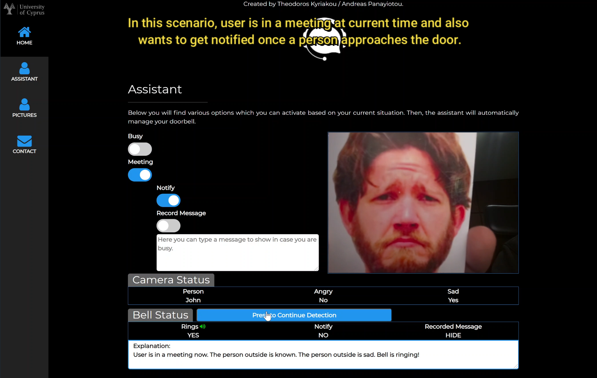

<!-- ABOUT THE PROJECT -->
## About The Project

In this project we have implemented and evaluate three community detection algorithms.

* Louvain Algorithm
* Label Propagation Algorithm
* Girvan-Newman Algorithm

Authors:
* Andreas Panayiotou
* Theodoros Kyriakou

## Prerequisites
 
* SWI-Prolog
* Gorgias Argumentation Framework ([Link](http://www.cs.ucy.ac.cy/~nkd/gorgias/))
* Java
* A web server stack (ex. XAMPP)
  
## Demonstration

In this section you can see an overview of the assistant as also you can watch a video which shows the function of the assistant.

[Demo Video Youtube Link](https://www.youtube.com/watch?v=y_E-IDVxr_o)

